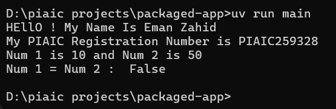

# Packaged App

This is a packaged Python application created using **uv** with `src` layout as part of Assignment 02.  

The app prints my **Eman Zahid** and **PIAIC Registration Number = PIAIC259328**, and also demonstrates a simple functionality:  

➡️ It defines two numbers, displays them, and checks if they are equal.

## How to Run

uv run main

## Screenshot

