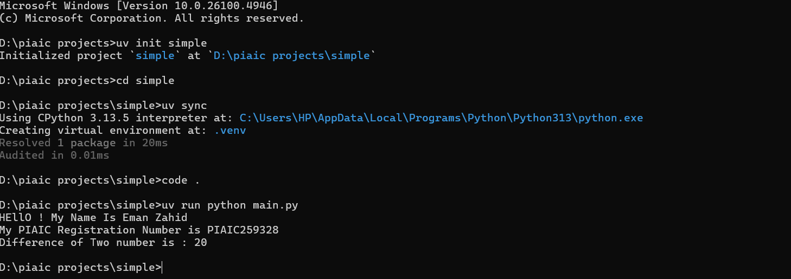

# Simple App

This is a simple Python application created using **uv** as part of Assignment 02.  
The app prints my **Eman Zahid** and **PIAIC Registration Number = PIAIC259328**, and also performs a simple functionality:  

➡️ It calculates the difference between two numbers.

## How to Run

uv run python main.py

## Screenshot

